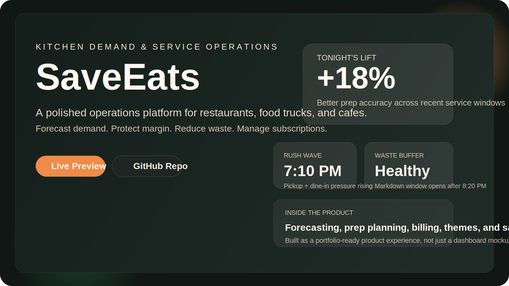
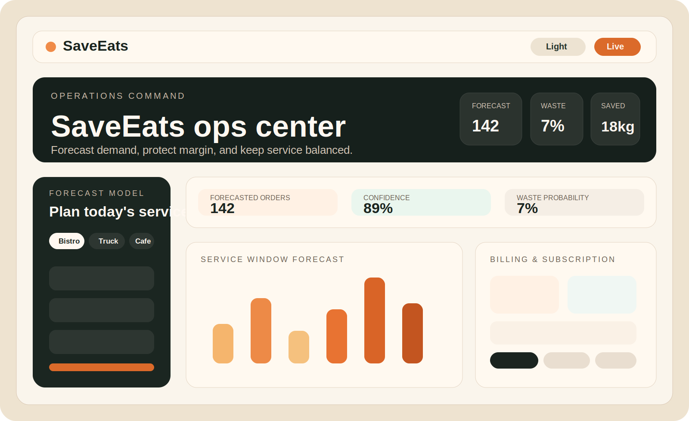

  

<h1 align="center">SaveEats</h1>

  Kitchen demand and service operations for restaurants, food trucks, and cafes.

  <a href="https://saveeats-kitchen-h7r7xff85-nikhil-rawats-projects-92c1a75c.vercel.app">Live Preview</a>
  ·
  <a href="https://github.com/nikkurawat77-commits/saveeats-kitchen-ops">GitHub Repo</a>

SaveEats is a polished product prototype that helps operators plan daily service, monitor demand patterns, reduce food waste, manage prep targets, review historical sales data, and explore subscription and billing flows inside one cohesive workspace.

## Live Project

- Live preview: https://saveeats-kitchen-h7r7xff85-nikhil-rawats-projects-92c1a75c.vercel.app
- GitHub repo: https://github.com/nikkurawat77-commits/saveeats-kitchen-ops

## Features

- Public landing page with product branding and pricing
- Authentication flow for workspace access
- Service demand forecasting dashboard
- Historical sales import via CSV
- Prep planning and waste-risk recommendations
- Billing and subscription management UI
- Light mode and dark mode support
- Vercel deployment setup for live preview hosting

## Screenshots

### Product Overview

### Dashboard Preview

## Tech Stack

- HTML
- CSS
- Vanilla JavaScript
- Node.js
- Vercel serverless API for deployment preview

## Project Structure

- `index.html` contains the landing page and app shell
- `styles.css` contains the full visual system, responsive layout, and theme styling
- `app.js` contains frontend state, auth flow, forecasting requests, billing UI updates, and theme switching
- `server.js` supports local Node-based development
- `api/index.js` provides the Vercel serverless API version used for deployment
- `vercel.json` configures routing for preview deployment

## Local Development

1. Run `node server.js`
2. Open `http://localhost:3000`

## Portfolio Positioning

SaveEats can be presented as a product design plus engineering project that demonstrates:

- end-to-end product thinking
- frontend branding and UX direction
- full-stack application structure
- deployment and publishing workflow
- operations-focused dashboard design

## Notes

- The billing system is currently a polished product demo flow, not a live payment integration.
- The deployed preview uses a serverless demo data model appropriate for showcasing the product.
